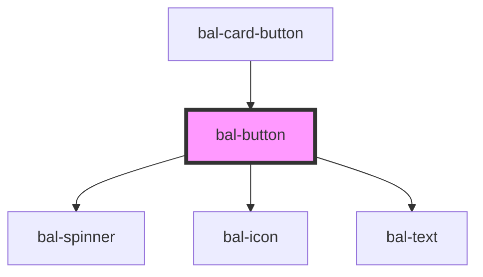

# bal-button

The classic button, in different colors, sizes, and states


<!-- Auto Generated Examples -->

## Examples
### Basic

<div class="bal-app">
<bal-button type="is-primary">Primary</bal-button>
<bal-button type="is-info">Info</bal-button>
<bal-button type="is-link">Link</bal-button>
</div>

```html
<bal-button type="is-primary">Primary</bal-button>
<bal-button type="is-info">Info</bal-button>
<bal-button type="is-link">Link</bal-button>
```

### Outlined

<div class="bal-app">
<bal-button type="is-info" outlined>Info</bal-button>
</div>

```html
<bal-button type="is-info" outlined>Info</bal-button>
```

### Inverted

<div class="bal-app">
<div class="has-background-info is-padded">
  <bal-button type="is-primary" inverted>Primary</bal-button>
  <bal-button type="is-info" inverted>Info</bal-button>
  <bal-button type="is-info" inverted outlined>Info Outlined</bal-button>
</div>
</div>

```html
<div class="has-background-info is-padded">
  <bal-button type="is-primary" inverted>Primary</bal-button>
  <bal-button type="is-info" inverted>Info</bal-button>
  <bal-button type="is-info" inverted outlined>Info Outlined</bal-button>
</div>
```

### Other colors

<div class="bal-app">
<bal-button type="is-warning">Warning</bal-button>
<bal-button type="is-danger">Danger</bal-button>
</div>

```html
<bal-button type="is-warning">Warning</bal-button>
<bal-button type="is-danger">Danger</bal-button>
```

### Disabled

<div class="bal-app">
<bal-button type="is-primary" disabled>Primary</bal-button>
<bal-button type="is-info" disabled>Info</bal-button>
<bal-button type="is-link" disabled>Link</bal-button>
</div>

```html
<bal-button type="is-primary" disabled>Primary</bal-button>
<bal-button type="is-info" disabled>Info</bal-button>
<bal-button type="is-link" disabled>Link</bal-button>
```

### Loading

<div class="bal-app">
<bal-button type="is-primary" loading>Primary</bal-button>
<bal-button type="is-info" loading>Info</bal-button>
</div>

```html
<bal-button type="is-primary" loading>Primary</bal-button>
<bal-button type="is-info" loading>Info</bal-button>
```

### Expanded

<div class="bal-app">
<bal-button type="is-primary" expanded>Primary</bal-button>
<br>
<bal-button type="is-info" expanded>Info</bal-button>
</div>

```html
<bal-button type="is-primary" expanded>Primary</bal-button>
<br>
<bal-button type="is-info" expanded>Info</bal-button>
```

### With icons

<div class="bal-app">
<bal-button type="is-info" outlined icon="edit">Edit</bal-button>
<bal-button inverted light icon="edit">Edit</bal-button>
<bal-button type="is-info" outlined icon-right="caret-down">Dropdown</bal-button>
</div>

```html
<bal-button type="is-info" outlined icon="edit">Edit</bal-button>
<bal-button inverted light icon="edit">Edit</bal-button>
<bal-button type="is-info" outlined icon-right="caret-down">Dropdown</bal-button>
```

### Small buttons

<div class="bal-app">
<bal-button type="is-primary" size="is-small"> Primary </bal-button> 
<bal-button type="is-info" size="is-small"> Info </bal-button>
</div>

```html
<bal-button type="is-primary" size="is-small"> Primary </bal-button> 
<bal-button type="is-info" size="is-small"> Info </bal-button>
```

### Square buttons

<div class="bal-app">
<bal-button type="is-info" size="is-small" is-square outlined>
  <bal-icon name="edit" size="medium"></bal-icon>
</bal-button>
<bal-button type="is-info" size="is-small" is-square outlined>
  <bal-icon name="trash" size="medium"></bal-icon>
</bal-button>
</div>

```html
<bal-button type="is-info" size="is-small" is-square outlined>
  <bal-icon name="edit" size="medium"></bal-icon>
</bal-button>
<bal-button type="is-info" size="is-small" is-square outlined>
  <bal-icon name="trash" size="medium"></bal-icon>
</bal-button>
```

<script type="text/javascript"></script>

## API

<!-- Auto Generated Below -->


## Properties

| Property        | Attribute        | Description                                                           | Type                                                                                    | Default        |
| --------------- | ---------------- | --------------------------------------------------------------------- | --------------------------------------------------------------------------------------- | -------------- |
| `bottomRounded` | `bottom-rounded` | If `true` the bottom corners get rounded                              | `boolean`                                                                               | `false`        |
| `dense`         | `dense`          | If `true` the button is dense                                         | `boolean`                                                                               | `undefined`    |
| `disabled`      | `disabled`       | If `true` the button is disabled                                      | `boolean`                                                                               | `undefined`    |
| `expanded`      | `expanded`       | If `true` the button has a full width                                 | `boolean`                                                                               | `undefined`    |
| `icon`          | `icon`           | Name of the left button icon                                          | `string`                                                                                | `''`           |
| `iconRight`     | `icon-right`     | Name of the right button icon                                         | `string`                                                                                | `''`           |
| `inverted`      | `inverted`       | If `true` the button is inverted                                      | `boolean`                                                                               | `undefined`    |
| `isActive`      | `is-active`      | If `true` the button has a active theme                               | `boolean`                                                                               | `false`        |
| `isSquare`      | `is-square`      | If `true` the width of the buttons is limited                         | `boolean`                                                                               | `undefined`    |
| `light`         | `light`          | If `true` the button has a light color                                | `boolean`                                                                               | `undefined`    |
| `loading`       | `loading`        | If `true` the label is hidden and a loading spinner is shown instead. | `boolean`                                                                               | `undefined`    |
| `outlined`      | `outlined`       | If `true` the button is outlined                                      | `boolean`                                                                               | `undefined`    |
| `size`          | `size`           | Size of the button                                                    | `"" \| "is-small"`                                                                      | `''`           |
| `type`          | `type`           | The theme type of the button. Given by bulma our css framework.       | `"is-danger" \| "is-info" \| "is-link" \| "is-primary" \| "is-success" \| "is-warning"` | `'is-primary'` |


## Dependencies

### Used by

 - [bal-card-button](../bal-card-button)

### Depends on

- [bal-spinner](../bal-spinner)
- [bal-icon](../bal-icon)
- [bal-text](../bal-text)

### Graph


----------------------------------------------

*Built with [StencilJS](https://stenciljs.com/)*
