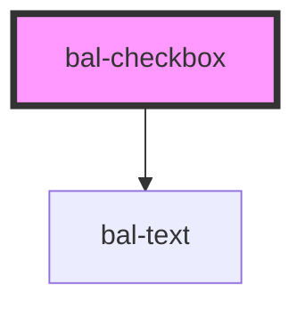

# bal-checkbox

Checkboxes allow the selection of multiple options from a set of options. They appear as checked (ticked) when activated. Clicking on a checkbox will toggle the **checked** property. They can also be checked programmatically by setting the **checked** property.

<!-- Auto Generated Examples -->

## Examples
### Basic

<div class="bal-app">
<bal-checkbox label="Label" data-test-id="checkbox-normal"></bal-checkbox>
<bal-checkbox label="Checked" checked></bal-checkbox>
<bal-checkbox label="Disabled" disabled data-test-id="checkbox-disabled"></bal-checkbox>
</div>

```html
<bal-checkbox label="Label" data-test-id="checkbox-normal"></bal-checkbox>
<bal-checkbox label="Checked" checked></bal-checkbox>
<bal-checkbox label="Disabled" disabled data-test-id="checkbox-disabled"></bal-checkbox>
```

### Inverted

<div class="bal-app">
<div class="has-background-info is-padded">
  <bal-checkbox label="Label" inverted></bal-checkbox>
  <bal-checkbox label="Checked" inverted checked></bal-checkbox>
  <bal-checkbox label="Disabled" inverted disabled></bal-checkbox>
</div>
</div>

```html
<div class="has-background-info is-padded">
  <bal-checkbox label="Label" inverted></bal-checkbox>
  <bal-checkbox label="Checked" inverted checked></bal-checkbox>
  <bal-checkbox label="Disabled" inverted disabled></bal-checkbox>
</div>
```

### Events

#### Listen on Changes

<div class="bal-app">
<bal-checkbox id="checkbox-1" label="Listen on changes"></bal-checkbox>
<span id="checkbox-1-result">false</span>
</div>

```html
<bal-checkbox id="checkbox-1" label="Listen on changes"></bal-checkbox>
<span id="checkbox-1-result">false</span>
```

```javascript
var checkbox1 = document.getElementById('checkbox-1')
var checkboxResult = document.getElementById('checkbox-1-result')
checkbox1.addEventListener('balChange', function (event) {
  checkboxResult.innerHTML = event.detail
})
```

#### Change value

<div class="bal-app">
<bal-checkbox id="checkbox-2" label="Value"></bal-checkbox>
<button id="checkbox-2-trigger-1">Set to true</button>
<button id="checkbox-2-trigger-2">Set to false</button>
</div>

```html
<bal-checkbox id="checkbox-2" label="Value"></bal-checkbox>
<button id="checkbox-2-trigger-1">Set to true</button>
<button id="checkbox-2-trigger-2">Set to false</button>
```

```javascript
var checkbox2 = document.getElementById('checkbox-2')
var checkboxTrigger1 = document.getElementById('checkbox-2-trigger-1')
var checkboxTrigger2 = document.getElementById('checkbox-2-trigger-2')
checkboxTrigger1.addEventListener('click', function (event) {
  checkbox2.checked = true
})
checkboxTrigger2.addEventListener('click', function (event) {
  checkbox2.checked = false
})
```

<script type="text/javascript">
var checkbox1 = document.getElementById('checkbox-1')
var checkboxResult = document.getElementById('checkbox-1-result')
checkbox1.addEventListener('balChange', function (event) {
  checkboxResult.innerHTML = event.detail
})


var checkbox2 = document.getElementById('checkbox-2')
var checkboxTrigger1 = document.getElementById('checkbox-2-trigger-1')
var checkboxTrigger2 = document.getElementById('checkbox-2-trigger-2')
checkboxTrigger1.addEventListener('click', function (event) {
  checkbox2.checked = true
})
checkboxTrigger2.addEventListener('click', function (event) {
  checkbox2.checked = false
})
</script>

## API

<!-- Auto Generated Below -->


## Properties

| Property   | Attribute  | Description                                                     | Type      | Default        |
| ---------- | ---------- | --------------------------------------------------------------- | --------- | -------------- |
| `checked`  | `checked`  | If `true`, the checkbox is selected.                            | `boolean` | `false`        |
| `disabled` | `disabled` | If `true`, the user cannot interact with the checkbox.          | `boolean` | `false`        |
| `inverted` | `inverted` | If `true`, the control works on dark background.                | `boolean` | `false`        |
| `label`    | `label`    | The label of the control.                                       | `string`  | `''`           |
| `name`     | `name`     | The name of the control, which is submitted with the form data. | `string`  | `this.inputId` |
| `value`    | `value`    | The value of the control.                                       | `string`  | `'on'`         |


## Events

| Event       | Description                                    | Type                   |
| ----------- | ---------------------------------------------- | ---------------------- |
| `balBlur`   | Emitted when the toggle loses focus.           | `CustomEvent<void>`    |
| `balChange` | Emitted when the checked property has changed. | `CustomEvent<boolean>` |
| `balFocus`  | Emitted when the toggle has focus.             | `CustomEvent<void>`    |


## Methods

### `setFocus() => Promise<void>`


#### Returns

Type: `Promise<void>`


## Dependencies

### Depends on

- [bal-text](../bal-text)

### Graph


----------------------------------------------

*Built with [StencilJS](https://stenciljs.com/)*
