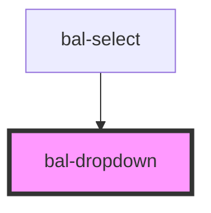

# bal-dropdown


<!-- Auto Generated Examples -->

## Examples
### Basic

<div class="bal-app">
<bal-dropdown id="bal-dropdown-1" scrollable="200" is-active="false">
  <bal-button id="bal-dropdown-1-trigger"
    slot="trigger"
    aria-haspopup="true"
    aria-controls="dropdown-menu"
    type="is-info"
    outlined
    icon-right="caret-down"
  >
    <span id="bal-dropdown-1-trigger-label">Trigger</span>
  </bal-button>
</bal-dropdown>
</div>

```html
<bal-dropdown id="bal-dropdown-1" scrollable="200" is-active="false">
  <bal-button id="bal-dropdown-1-trigger"
    slot="trigger"
    aria-haspopup="true"
    aria-controls="dropdown-menu"
    type="is-info"
    outlined
    icon-right="caret-down"
  >
    <span id="bal-dropdown-1-trigger-label">Trigger</span>
  </bal-button>
</bal-dropdown>
```

```javascript
var dropdown = document.getElementById('bal-dropdown-1')
var trigger = document.getElementById('bal-dropdown-1-trigger')
var triggerLabel = document.getElementById('bal-dropdown-1-trigger-label')

var options = [
  { text: 'Ant-Man', value: 1 },
  { text: 'Spider-Man', value: 2 },
  { text: 'Iron-Man', value: 3 },
]
for (let index = 0; index < options.length; index++) {
  var option = options[index]
  var el = document.createElement('bal-dropdown-option')
  var label = document.createElement('span')
  label.innerHTML = option.text
  el.value = option
  el.appendChild(label)
  dropdown.appendChild(el)
  el.addEventListener('click', function () {
    dropdown.setAttribute('is-active', false)
  })
}

dropdown.addEventListener('balChange', function (evnet) {
  triggerLabel.innerHTML = evnet.detail.text
})

trigger.addEventListener('click', function (event) {
  var isActive = dropdown.getAttribute('is-active') == 'true'
  dropdown.setAttribute('is-active', !isActive)
})
```

### With an input

<div class="bal-app">
<bal-dropdown id="bal-dropdown-2" scrollable="200" is-active="false">
  <div class="control has-icons-right" slot="trigger">
    <bal-input id="bal-dropdown-trigger-2" clickable readonly ></bal-input>
    <bal-icon size="medium" name="caret-down" is-right ></bal-icon>
    <bal-icon size="medium" name="caret-down" is-right ></bal-icon>
  </div>
</bal-dropdown>
</div>

```html
<bal-dropdown id="bal-dropdown-2" scrollable="200" is-active="false">
  <div class="control has-icons-right" slot="trigger">
    <bal-input id="bal-dropdown-trigger-2" clickable readonly ></bal-input>
    <bal-icon size="medium" name="caret-down" is-right ></bal-icon>
    <bal-icon size="medium" name="caret-down" is-right ></bal-icon>
  </div>
</bal-dropdown>
```

```javascript
var dropdown2 = document.getElementById('bal-dropdown-2')
var trigger2 = document.getElementById('bal-dropdown-trigger-2')

for (let index = 0; index < options.length; index++) {
  var option = options[index]
  var el = document.createElement('bal-dropdown-option')
  var label = document.createElement('span')
  label.innerHTML = option.text
  el.value = option
  el.appendChild(label)
  dropdown2.appendChild(el)
  el.addEventListener('click', function () {
    dropdown2.setAttribute('is-active', false)
  })
}

dropdown2.addEventListener('balChange', function (evnet) {
  trigger2.value = evnet.detail.text
})

trigger2.addEventListener('click', function (event) {
  var isActive = dropdown2.getAttribute('is-active') == 'true'
  dropdown2.setAttribute('is-active', !isActive)
})
```

<script type="text/javascript">
var dropdown = document.getElementById('bal-dropdown-1')
var trigger = document.getElementById('bal-dropdown-1-trigger')
var triggerLabel = document.getElementById('bal-dropdown-1-trigger-label')

var options = [
  { text: 'Ant-Man', value: 1 },
  { text: 'Spider-Man', value: 2 },
  { text: 'Iron-Man', value: 3 },
]
for (let index = 0; index < options.length; index++) {
  var option = options[index]
  var el = document.createElement('bal-dropdown-option')
  var label = document.createElement('span')
  label.innerHTML = option.text
  el.value = option
  el.appendChild(label)
  dropdown.appendChild(el)
  el.addEventListener('click', function () {
    dropdown.setAttribute('is-active', false)
  })
}

dropdown.addEventListener('balChange', function (evnet) {
  triggerLabel.innerHTML = evnet.detail.text
})

trigger.addEventListener('click', function (event) {
  var isActive = dropdown.getAttribute('is-active') == 'true'
  dropdown.setAttribute('is-active', !isActive)
})


var dropdown2 = document.getElementById('bal-dropdown-2')
var trigger2 = document.getElementById('bal-dropdown-trigger-2')

for (let index = 0; index < options.length; index++) {
  var option = options[index]
  var el = document.createElement('bal-dropdown-option')
  var label = document.createElement('span')
  label.innerHTML = option.text
  el.value = option
  el.appendChild(label)
  dropdown2.appendChild(el)
  el.addEventListener('click', function () {
    dropdown2.setAttribute('is-active', false)
  })
}

dropdown2.addEventListener('balChange', function (evnet) {
  trigger2.value = evnet.detail.text
})

trigger2.addEventListener('click', function (event) {
  var isActive = dropdown2.getAttribute('is-active') == 'true'
  dropdown2.setAttribute('is-active', !isActive)
})
</script>

## API

<!-- Auto Generated Below -->


## Properties

| Property     | Attribute    | Description | Type      | Default     |
| ------------ | ------------ | ----------- | --------- | ----------- |
| `isActive`   | `is-active`  |             | `boolean` | `false`     |
| `scrollable` | `scrollable` |             | `number`  | `0`         |
| `value`      | `value`      |             | `any`     | `undefined` |


## Events

| Event       | Description | Type                  |
| ----------- | ----------- | --------------------- |
| `balChange` |             | `CustomEvent<string>` |


## Methods

### `close() => Promise<void>`

Closes the dropdown menu.

#### Returns

Type: `Promise<void>`


### `getContentElement() => Promise<HTMLDivElement>`


#### Returns

Type: `Promise<HTMLDivElement>`


### `getMenuElement() => Promise<HTMLDivElement>`


#### Returns

Type: `Promise<HTMLDivElement>`


### `open() => Promise<void>`

Open the dropdown menu.

#### Returns

Type: `Promise<void>`


### `toggle() => Promise<void>`

Open or closes the dropdown.

#### Returns

Type: `Promise<void>`


## Dependencies

### Used by

 - [bal-select](../bal-select)

### Graph


----------------------------------------------

*Built with [StencilJS](https://stenciljs.com/)*
