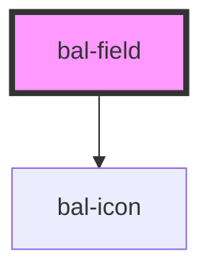

# bal-field

All generic form field, designed for consistency 


<!-- Auto Generated Examples -->

## Examples
<div class="bal-app">
<h2 class="title is-size-2">Basic</h2>
<bal-field id="bal-field-1" label="Firstname">
  <bal-input id="bal-input-1" name="firstName" placeholder="Enter your firstname"></bal-input>
</bal-field>
</div>

```html
<h2 class="title is-size-2">Basic</h2>
<bal-field id="bal-field-1" label="Firstname">
  <bal-input id="bal-input-1" name="firstName" placeholder="Enter your firstname"></bal-input>
</bal-field>
```

<div class="bal-app">
<h2 class="title is-size-2">Inverted</h2>
<div class="has-background-info is-padded">
  <bal-field icon-left="account" label="Firstname" validation-message="Field is required" loading inverted>
    <bal-input name="firstName" placeholder="Enter your firstname" inverted></bal-input>
  </bal-field>
</div>
</div>

```html
<h2 class="title is-size-2">Inverted</h2>
<div class="has-background-info is-padded">
  <bal-field icon-left="account" label="Firstname" validation-message="Field is required" loading inverted>
    <bal-input name="firstName" placeholder="Enter your firstname" inverted></bal-input>
  </bal-field>
</div>
```

<div class="bal-app">
<h2 class="title is-size-2">Icons</h2>
<bal-field label="Firstname" icon-left="account" icon-right="check">
  <bal-input name="firstName" placeholder="Enter your firstname"></bal-input>
</bal-field>
</div>

```html
<h2 class="title is-size-2">Icons</h2>
<bal-field label="Firstname" icon-left="account" icon-right="check">
  <bal-input name="firstName" placeholder="Enter your firstname"></bal-input>
</bal-field>
```

<script type="text/javascript"></script>

## API

<!-- Auto Generated Below -->


## Properties

| Property            | Attribute            | Description                                         | Type      | Default |
| ------------------- | -------------------- | --------------------------------------------------- | --------- | ------- |
| `iconLeft`          | `icon-left`          | Baloise icon for the left side of the input         | `string`  | `''`    |
| `iconRight`         | `icon-right`         | Baloise icon for the right side of the input        | `string`  | `''`    |
| `inverted`          | `inverted`           | If `true` the field can be used on blue background. | `boolean` | `false` |
| `label`             | `label`              | Label text                                          | `string`  | `''`    |
| `loading`           | `loading`            |                                                     | `boolean` | `false` |
| `required`          | `required`           | If `true` a asterix (*) is added to the label text  | `boolean` | `false` |
| `validationMessage` | `validation-message` | Validation message text                             | `string`  | `''`    |


## Dependencies

### Depends on

- [bal-icon](../bal-icon)

### Graph


----------------------------------------------

*Built with [StencilJS](https://stenciljs.com/)*
