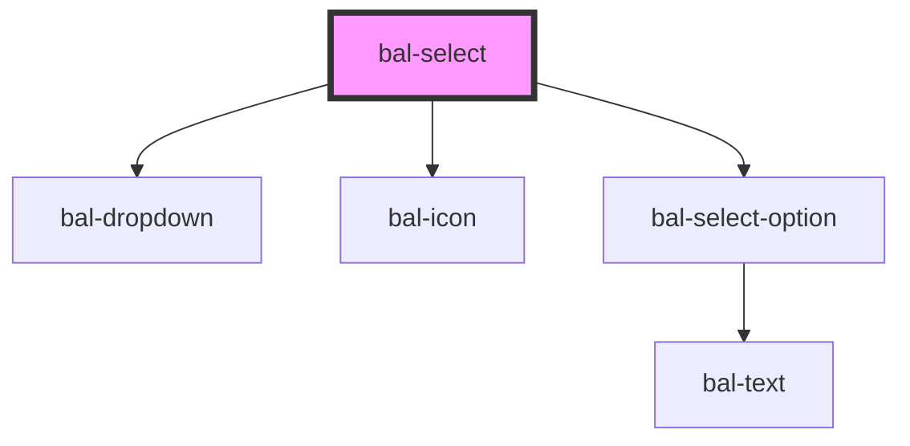

# bal-select


<!-- Auto Generated Examples -->

## Examples
### Basic

<div class="bal-app">
<bal-select id="bal-select-year" placeholder="select a year"></bal-select>
<bal-select id="bal-select-year-disabled" disabled placeholder="disabled"></bal-select>

<bal-button id="bal-select-year-clear">Clear</bal-button>
</div>

```html
<bal-select id="bal-select-year" placeholder="select a year"></bal-select>
<bal-select id="bal-select-year-disabled" disabled placeholder="disabled"></bal-select>

<bal-button id="bal-select-year-clear">Clear</bal-button>
```

```javascript
var selectYear = document.getElementById('bal-select-year')
var buttonYear = document.getElementById('bal-select-year-clear')
var optionsYear = []
for (var index = 1990; index < 2020; index++) {
  optionsYear.push({ text: `${index}`, value: index })
}
selectYear.options = optionsYear
buttonYear.addEventListener('click', function () {
  selectYear.clear()
})
```

### Custom Option Style

<div class="bal-app">
<bal-select id="bal-select-custom" placeholder="select a hero"></bal-select>
</div>

```html
<bal-select id="bal-select-custom" placeholder="select a hero"></bal-select>
```

```javascript
var selectCustom = document.getElementById('bal-select-custom')
var renderCustom = function (data) {
  return '<b>' + data.text + '</b></br><span>' + data.location + '</span>'
}
selectCustom.options = [
  { text: 'Ant-Man', value: 1, location: 'San Francisco', render: renderCustom },
  { text: 'Spider-Man', value: 2, location: 'Queens', render: renderCustom },
  { text: 'Iron Man', value: 3, location: 'Malibu', render: renderCustom },
]
```

### Typeahead

<div class="bal-app">
<bal-select id="bal-select-typeahead" typeahead placeholder="start typing"></bal-select>
</div>

```html
<bal-select id="bal-select-typeahead" typeahead placeholder="start typing"></bal-select>
```

```javascript
var selectTypeahead = document.getElementById('bal-select-typeahead')
selectTypeahead.options = [
  { text: 'Ant-Man', value: 1, location: 'San Francisco', render: renderCustom },
  { text: 'Spider-Man', value: 2, location: 'Queens', render: renderCustom },
  { text: 'Iron Man', value: 3, location: 'Malibu', render: renderCustom },
  { text: 'Black Panter', value: 4, location: 'Wakanda', render: renderCustom },
  { text: 'Black Widow', value: 5, location: 'Russia', render: renderCustom },
  { text: 'Captain America', value: 6, location: 'Brooklyn', render: renderCustom },
  { text: 'Captain Marvel', value: 7, location: 'Somewhere', render: renderCustom },
  { text: 'Vision', value: 8, location: 'Scotland', render: renderCustom },
  { text: 'Falcon', value: 9, location: 'Washington', render: renderCustom },
  { text: 'Thor', value: 10, location: 'Asgard', render: renderCustom },
  { text: 'Hulk', value: 11, location: 'Hidden', render: renderCustom },
  { text: 'Hawkeye', value: 12, location: 'Shield', render: renderCustom },
  { text: 'Doctor Strange', value: 13, location: 'Manhatten', render: renderCustom },
  { text: 'Wasp', value: 14, location: 'San Francisco', render: renderCustom },
]
```

#### Remote

<div class="bal-app">
<bal-select id="bal-select-typeahead-remote" typeahead remote placeholder="start typing"></bal-select>
</div>

```html
<bal-select id="bal-select-typeahead-remote" typeahead remote placeholder="start typing"></bal-select>
```

```javascript
var selectTypeaheadRemote = document.getElementById('bal-select-typeahead-remote')
selectTypeaheadRemote.options = []
selectTypeaheadRemote.addEventListener('balInput', function (event) {
  var search = event.detail
  selectTypeaheadRemote.loading = true
  fetch('https://swapi.dev/api/people/?search=' + search)
    .then(res => res.json())
    .then(data => {
      selectTypeaheadRemote.options = data.results.map((person, index) => ({
        value: index,
        text: person.name,
      }))
      selectTypeaheadRemote.loading = false
    })
})
```

<script type="text/javascript">
var selectYear = document.getElementById('bal-select-year')
var buttonYear = document.getElementById('bal-select-year-clear')
var optionsYear = []
for (var index = 1990; index < 2020; index++) {
  optionsYear.push({ text: `${index}`, value: index })
}
selectYear.options = optionsYear
buttonYear.addEventListener('click', function () {
  selectYear.clear()
})


var selectCustom = document.getElementById('bal-select-custom')
var renderCustom = function (data) {
  return '<b>' + data.text + '</b></br><span>' + data.location + '</span>'
}
selectCustom.options = [
  { text: 'Ant-Man', value: 1, location: 'San Francisco', render: renderCustom },
  { text: 'Spider-Man', value: 2, location: 'Queens', render: renderCustom },
  { text: 'Iron Man', value: 3, location: 'Malibu', render: renderCustom },
]


var selectTypeahead = document.getElementById('bal-select-typeahead')
selectTypeahead.options = [
  { text: 'Ant-Man', value: 1, location: 'San Francisco', render: renderCustom },
  { text: 'Spider-Man', value: 2, location: 'Queens', render: renderCustom },
  { text: 'Iron Man', value: 3, location: 'Malibu', render: renderCustom },
  { text: 'Black Panter', value: 4, location: 'Wakanda', render: renderCustom },
  { text: 'Black Widow', value: 5, location: 'Russia', render: renderCustom },
  { text: 'Captain America', value: 6, location: 'Brooklyn', render: renderCustom },
  { text: 'Captain Marvel', value: 7, location: 'Somewhere', render: renderCustom },
  { text: 'Vision', value: 8, location: 'Scotland', render: renderCustom },
  { text: 'Falcon', value: 9, location: 'Washington', render: renderCustom },
  { text: 'Thor', value: 10, location: 'Asgard', render: renderCustom },
  { text: 'Hulk', value: 11, location: 'Hidden', render: renderCustom },
  { text: 'Hawkeye', value: 12, location: 'Shield', render: renderCustom },
  { text: 'Doctor Strange', value: 13, location: 'Manhatten', render: renderCustom },
  { text: 'Wasp', value: 14, location: 'San Francisco', render: renderCustom },
]


var selectTypeaheadRemote = document.getElementById('bal-select-typeahead-remote')
selectTypeaheadRemote.options = []
selectTypeaheadRemote.addEventListener('balInput', function (event) {
  var search = event.detail
  selectTypeaheadRemote.loading = true
  fetch('https://swapi.dev/api/people/?search=' + search)
    .then(res => res.json())
    .then(data => {
      selectTypeaheadRemote.options = data.results.map((person, index) => ({
        value: index,
        text: person.name,
      }))
      selectTypeaheadRemote.loading = false
    })
})
</script>

## API

<!-- Auto Generated Below -->


## Properties

| Property      | Attribute     | Description | Type                    | Default     |
| ------------- | ------------- | ----------- | ----------------------- | ----------- |
| `disabled`    | `disabled`    |             | `boolean`               | `false`     |
| `loading`     | `loading`     |             | `boolean`               | `false`     |
| `options`     | --            |             | `BalOptionValue<any>[]` | `[]`        |
| `placeholder` | `placeholder` |             | `string`                | `''`        |
| `remote`      | `remote`      |             | `boolean`               | `false`     |
| `scrollable`  | `scrollable`  |             | `number`                | `250`       |
| `typeahead`   | `typeahead`   |             | `boolean`               | `false`     |
| `value`       | --            |             | `BalOptionValue<any>`   | `undefined` |


## Events

| Event         | Description | Type                               |
| ------------- | ----------- | ---------------------------------- |
| `balBlur`     |             | `CustomEvent<FocusEvent>`          |
| `balChange`   |             | `CustomEvent<BalOptionValue<any>>` |
| `balClick`    |             | `CustomEvent<MouseEvent>`          |
| `balFocus`    |             | `CustomEvent<FocusEvent>`          |
| `balInput`    |             | `CustomEvent<string>`              |
| `balKeyDown`  |             | `CustomEvent<KeyboardEvent>`       |
| `balKeyPress` |             | `CustomEvent<KeyboardEvent>`       |
| `balKeyUp`    |             | `CustomEvent<KeyboardEvent>`       |


## Methods

### `clear() => Promise<void>`


#### Returns

Type: `Promise<void>`


## Dependencies

### Depends on

- [bal-dropdown](../bal-dropdown)
- [bal-icon](../bal-icon)
- [bal-select-option](../bal-select-option)

### Graph


----------------------------------------------

*Built with [StencilJS](https://stenciljs.com/)*
