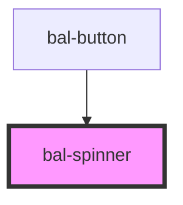

# bal-spinner

A simple loading spinner.

<!-- Auto Generated Examples -->

## Examples
### Basic

<div class="bal-app">
<bal-spinner></bal-spinner>
</div>

```html
<bal-spinner></bal-spinner>
```

### Small

<div class="bal-app">
<bal-spinner small></bal-spinner>
</div>

```html
<bal-spinner small></bal-spinner>
```

### Inverted

<div class="bal-app">
<div class="has-background-info is-padded">
  <bal-spinner inverted></bal-spinner>
</div>
</div>

```html
<div class="has-background-info is-padded">
  <bal-spinner inverted></bal-spinner>
</div>
```

<script type="text/javascript"></script>

## API

<!-- Auto Generated Below -->


## Properties

| Property   | Attribute  | Description | Type      | Default |
| ---------- | ---------- | ----------- | --------- | ------- |
| `inverted` | `inverted` |             | `boolean` | `false` |
| `small`    | `small`    |             | `boolean` | `false` |


## Dependencies

### Used by

 - [bal-button](../bal-button)

### Graph


----------------------------------------------

*Built with [StencilJS](https://stenciljs.com/)*
