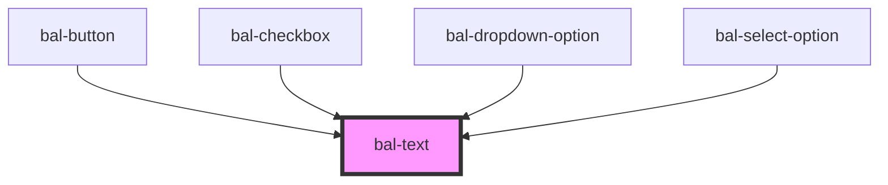

# bal-text


<!-- Auto Generated Examples -->

## Examples
### Basic

<div class="bal-app">
<bal-text> Lorem ipsum dolor sit amet consectetur adipisicing elit. </bal-text>
</div>

```html
<bal-text> Lorem ipsum dolor sit amet consectetur adipisicing elit. </bal-text>
```

<script type="text/javascript"></script>

## API

<!-- Auto Generated Below -->


## Dependencies

### Used by

 - [bal-button](../bal-button)
 - [bal-checkbox](../bal-checkbox)
 - [bal-dropdown-option](../bal-dropdown-option)
 - [bal-select-option](../bal-select-option)

### Graph


----------------------------------------------

*Built with [StencilJS](https://stenciljs.com/)*
