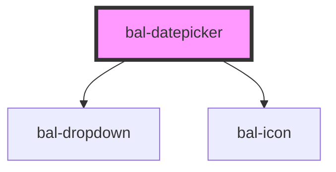

# bal-datepicker

An input with a simple dropdown for selecting a date.

## Usage

```html
<bal-datepicker></bal-datepicker>
```

## Inverted style

```html
<div class="has-background-info is-padded">
  <bal-datepicker inverted></bal-datepicker>
</div>
```

### Set Date

```html
<bal-datepicker value="20.02.2020"></bal-datepicker>
```

### Date Range

You can limit the date range with min-date and max-date props.

<script type="text/javascript">
    document.getElementById('bal-datepicker-range-example').addEventListener('balChange', event => { 
        console.log('balChange on bal-datepicker-range-example', event) 
    });
    document.getElementById('bal-datepicker-range-example').addEventListener('balBlur', event => { 
        console.log('balBlur on bal-datepicker-range-example', event) 
    });
    document.getElementById('bal-datepicker-filter-example').filter =  function (str) {
      return parseInt(str.substring(0, 2)) == 5;
    };
</script>

```html
<bal-datepicker id="bal-datepicker-range-example" min-date="10.02.2020" max-date="22.02.2020" value="20.02.2020"></bal-datepicker>
```

### Filter

```typescript
document.getElementById('bal-datepicker-filter-example').filter =  function (str) {
  return parseInt(str.substring(0, 2)) == 5;
};
```

```html
<bal-datepicker id="bal-datepicker-filter-example"></bal-datepicker>
```

### With content

```html
<bal-datepicker value="20.02.2020">
  <p style="text-align: center;">Choose your arival date!</p>
</bal-datepicker>
```

### Disabled

```html
<bal-datepicker disabled value="20.02.2020"></bal-datepicker>
```

<!-- Auto Generated Below -->


## Properties

| Property        | Attribute         | Description                                                              | Type                           | Default     |
| --------------- | ----------------- | ------------------------------------------------------------------------ | ------------------------------ | ----------- |
| `closeOnSelect` | `close-on-select` | Closes the datepicker dropdown after selection                           | `boolean`                      | `true`      |
| `disabled`      | `disabled`        | If `true` the component is diabled.                                      | `boolean`                      | `false`     |
| `expanded`      | `expanded`        | If `true` the component uses the whole width.                            | `boolean`                      | `false`     |
| `filter`        | --                | Callback to determine which date in the datepicker should be selectable. | `(date: Date) => boolean`      | `_ => true` |
| `inverted`      | `inverted`        | Set this to `true` when the component is placed on a dark background.    | `boolean`                      | `false`     |
| `locale`        | `locale`          | If `true` the component uses the whole width.                            | `"de" \| "en" \| "fr" \| "it"` | `'en'`      |
| `maxDate`       | --                | Latest date available for selection                                      | `Date`                         | `undefined` |
| `maxYearProp`   | `max-year`        | Latest year available for selection                                      | `number`                       | `undefined` |
| `minDate`       | --                | Earliest date available for selection                                    | `Date`                         | `undefined` |
| `minYearProp`   | `min-year`        | Earliest year available for selection                                    | `number`                       | `undefined` |
| `placeholder`   | `placeholder`     | Defines the placeholder of the input element.                            | `string`                       | `''`        |
| `readonly`      | `readonly`        | If `true` the use can only select a date.                                | `boolean`                      | `false`     |
| `triggerIcon`   | `trigger-icon`    | If `true` the datepicker only open on click of the icon                  | `boolean`                      | `false`     |
| `value`         | --                | Selected option value.                                                   | `Date`                         | `undefined` |


## Events

| Event       | Description                             | Type                      |
| ----------- | --------------------------------------- | ------------------------- |
| `balBlur`   | Emitted when the input loses focus.     | `CustomEvent<FocusEvent>` |
| `balChange` | Emitted when a option got selected.     | `CustomEvent<any>`        |
| `balFocus`  | Emitted when the input has focus.       | `CustomEvent<FocusEvent>` |
| `balInput`  | Emitted when a keyboard input occurred. | `CustomEvent<string>`     |


## Methods

### `select(date: Date) => Promise<void>`

Selects an option

#### Returns

Type: `Promise<void>`


## Dependencies

### Depends on

- [bal-dropdown](../bal-dropdown)
- [bal-icon](../bal-icon)

### Graph


----------------------------------------------

*Built with [StencilJS](https://stenciljs.com/)*
