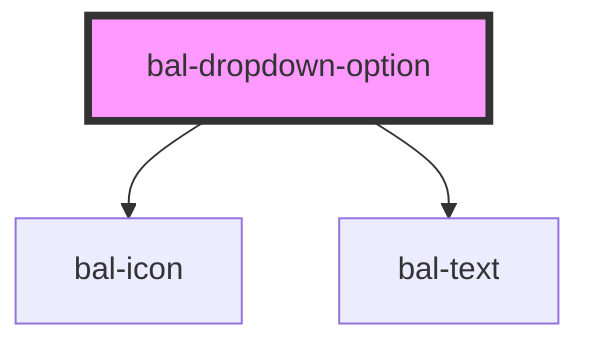

<!-- docs:child of bal-dropdown -->

# bal-dropdown-option

`bal-dropdown-option` is a child component of `bal-dropdown`.

<!-- Auto Generated Below -->

## Properties

| Property   | Attribute  | Description                                                                                       | Type      | Default |
| ---------- | ---------- | ------------------------------------------------------------------------------------------------- | --------- | ------- |
| `focused`  | `focused`  | If `true` the option is focused                                                                   | `boolean` | `false` |
| `icon`     | `icon`     | Baloise icon as a prefix                                                                          | `string`  | `''`    |
| `selected` | `selected` | If `true` the option is selected                                                                  | `boolean` | `false` |
| `value`    | `value`    | The value of the dropdown item. This value will be returned by the parent <bal-dropdown> element. | `any`     | `false` |

## Events

| Event                     | Description | Type               |
| ------------------------- | ----------- | ------------------ |
| `balDropdownOptionSelect` |             | `CustomEvent<any>` |

## Dependencies

### Depends on

- [bal-icon](../bal-icon)
- [bal-text](../bal-text)

### Graph

----------------------------------------------

*Built with [StencilJS](https://stenciljs.com/)*
