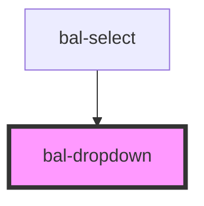

# bal-dropdown

<!-- Auto Generated Below -->

## Properties

| Property     | Attribute    | Description | Type      | Default     |
| ------------ | ------------ | ----------- | --------- | ----------- |
| `isActive`   | `is-active`  |             | `boolean` | `false`     |
| `scrollable` | `scrollable` |             | `number`  | `0`         |
| `value`      | `value`      |             | `any`     | `undefined` |

## Events

| Event       | Description | Type                  |
| ----------- | ----------- | --------------------- |
| `balChange` |             | `CustomEvent<string>` |

## Methods

### `close() => Promise<void>`

Closes the dropdown menu.

#### Returns

Type: `Promise<void>`

### `getContentElement() => Promise<HTMLDivElement>`

#### Returns

Type: `Promise<HTMLDivElement>`

### `getMenuElement() => Promise<HTMLDivElement>`

#### Returns

Type: `Promise<HTMLDivElement>`

### `open() => Promise<void>`

Open the dropdown menu.

#### Returns

Type: `Promise<void>`

### `toggle() => Promise<void>`

Open or closes the dropdown.

#### Returns

Type: `Promise<void>`

## Dependencies

### Used by

 - [bal-select](../bal-select)

### Graph

----------------------------------------------

*Built with [StencilJS](https://stenciljs.com/)*
