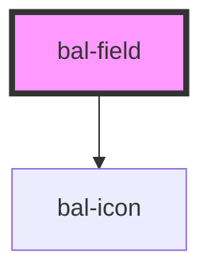

# bal-field

All generic form field, designed for consistency 

<!-- Auto Generated Below -->

## Properties

| Property            | Attribute            | Description                                         | Type      | Default |
| ------------------- | -------------------- | --------------------------------------------------- | --------- | ------- |
| `iconLeft`          | `icon-left`          | Baloise icon for the left side of the input         | `string`  | `''`    |
| `iconRight`         | `icon-right`         | Baloise icon for the right side of the input        | `string`  | `''`    |
| `inverted`          | `inverted`           | If `true` the field can be used on blue background. | `boolean` | `false` |
| `label`             | `label`              | Label text                                          | `string`  | `''`    |
| `loading`           | `loading`            |                                                     | `boolean` | `false` |
| `required`          | `required`           | If `true` a asterix (*) is added to the label text  | `boolean` | `false` |
| `validationMessage` | `validation-message` | Validation message text                             | `string`  | `''`    |

## Dependencies

### Depends on

- [bal-icon](../bal-icon)

### Graph

----------------------------------------------

*Built with [StencilJS](https://stenciljs.com/)*
