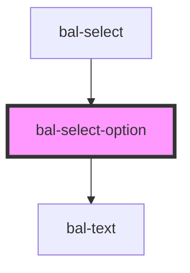

<!-- docs:child of bal-select -->

# bal-select-option

<!-- Auto Generated Below -->

## Properties

| Property   | Attribute  | Description                                                                                       | Type                  | Default     |
| ---------- | ---------- | ------------------------------------------------------------------------------------------------- | --------------------- | ----------- |
| `focused`  | `focused`  | If `true` the option is focused                                                                   | `boolean`             | `false`     |
| `hidden`   | `hidden`   | If `true` the option is hidden                                                                    | `boolean`             | `false`     |
| `icon`     | `icon`     | Baloise icon as a prefix                                                                          | `string`              | `''`        |
| `selected` | `selected` | If `true` the option is selected                                                                  | `boolean`             | `false`     |
| `value`    | --         | The value of the dropdown item. This value will be returned by the parent <bal-dropdown> element. | `BalOptionValue<any>` | `undefined` |

## Dependencies

### Used by

 - [bal-select](../bal-select)

### Depends on

- [bal-text](../bal-text)

### Graph

----------------------------------------------

*Built with [StencilJS](https://stenciljs.com/)*
