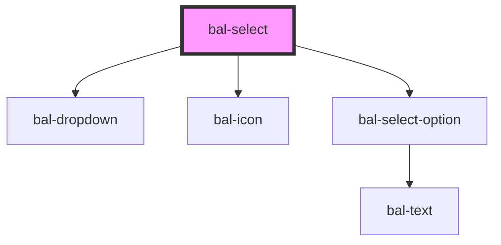

# bal-select

Select fields components are used for collecting user provided information from a list of options.

> Two-way binding with `v-model` or `ng-model` is available.

## Option interface

```typescript
export interface BalOptionValue<T> {
  value: T
  text: string
  render?(option: BalOptionValue<T>): string
}
```

<!-- Auto Generated Below -->


## Properties

| Property      | Attribute     | Description                                                                     | Type                    | Default     |
| ------------- | ------------- | ------------------------------------------------------------------------------- | ----------------------- | ----------- |
| `disabled`    | `disabled`    | If `true` the component is diabled.                                             | `boolean`               | `false`     |
| `expanded`    | `expanded`    | If `true` the component uses the whole width.                                   | `boolean`               | `false`     |
| `inverted`    | `inverted`    | Set this to `true` when the component is placed on a dark background.           | `boolean`               | `false`     |
| `loading`     | `loading`     | If `true` the component shows a loading spinner and sets the input to readonly. | `boolean`               | `false`     |
| `options`     | --            | List of the options.                                                            | `BalOptionValue<any>[]` | `[]`        |
| `placeholder` | `placeholder` | Defines the placeholder of the input element.                                   | `string`                | `''`        |
| `remote`      | `remote`      | If `true` the filtering of the options is done outside of the component.        | `boolean`               | `false`     |
| `scrollable`  | `scrollable`  | Defines the height of the dropdown list.                                        | `number`                | `250`       |
| `typeahead`   | `typeahead`   | If `true` the user can search by typing into the input field.                   | `boolean`               | `false`     |
| `value`       | --            | Selected option value.                                                          | `BalOptionValue<any>`   | `undefined` |


## Events

| Event               | Description                                                        | Type                               |
| ------------------- | ------------------------------------------------------------------ | ---------------------------------- |
| `balSelectBlur`     | Emitted when the input loses focus.                                | `CustomEvent<FocusEvent>`          |
| `balSelectChange`   | Emitted when a option got selected.                                | `CustomEvent<BalOptionValue<any>>` |
| `balSelectClick`    | Emitted when the input got clicked.                                | `CustomEvent<MouseEvent>`          |
| `balSelectFocus`    | Emitted when the input has focus.                                  | `CustomEvent<FocusEvent>`          |
| `balSelectInput`    | Emitted when a keyboard input occurred.                            | `CustomEvent<string>`              |
| `balSelectKeyPress` | Emitted when the input has focus and key from the keyboard go hit. | `CustomEvent<KeyboardEvent>`       |


## Methods

### `clear() => Promise<void>`

Sets the value to null and resets the value of the input.

#### Returns

Type: `Promise<void>`


## Dependencies

### Depends on

- [bal-dropdown](../bal-dropdown)
- [bal-icon](../bal-icon)
- [bal-select-option](../bal-select-option)

### Graph


----------------------------------------------

*Built with [StencilJS](https://stenciljs.com/)*
