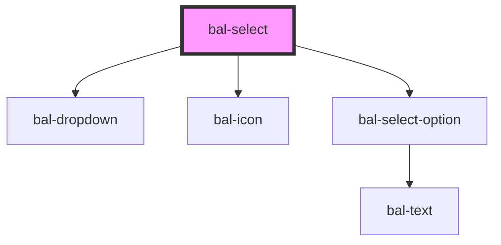

# bal-select

Select fields components are used for collecting user provided information from a list of options.

> Lorem Ipsum

<!-- Auto Generated Below -->

## Properties

| Property      | Attribute     | Description | Type                    | Default     |
| ------------- | ------------- | ----------- | ----------------------- | ----------- |
| `disabled`    | `disabled`    |             | `boolean`               | `false`     |
| `expanded`    | `expanded`    |             | `boolean`               | `false`     |
| `inverted`    | `inverted`    |             | `boolean`               | `false`     |
| `loading`     | `loading`     |             | `boolean`               | `false`     |
| `options`     | --            |             | `BalOptionValue<any>[]` | `[]`        |
| `placeholder` | `placeholder` |             | `string`                | `''`        |
| `remote`      | `remote`      |             | `boolean`               | `false`     |
| `scrollable`  | `scrollable`  |             | `number`                | `250`       |
| `typeahead`   | `typeahead`   |             | `boolean`               | `false`     |
| `value`       | --            |             | `BalOptionValue<any>`   | `undefined` |

## Events

| Event         | Description | Type                               |
| ------------- | ----------- | ---------------------------------- |
| `balBlur`     |             | `CustomEvent<FocusEvent>`          |
| `balChange`   |             | `CustomEvent<BalOptionValue<any>>` |
| `balClick`    |             | `CustomEvent<MouseEvent>`          |
| `balFocus`    |             | `CustomEvent<FocusEvent>`          |
| `balInput`    |             | `CustomEvent<string>`              |
| `balKeyDown`  |             | `CustomEvent<KeyboardEvent>`       |
| `balKeyPress` |             | `CustomEvent<KeyboardEvent>`       |
| `balKeyUp`    |             | `CustomEvent<KeyboardEvent>`       |

## Methods

### `clear() => Promise<void>`

#### Returns

Type: `Promise<void>`

## Dependencies

### Depends on

- [bal-dropdown](../bal-dropdown)
- [bal-icon](../bal-icon)
- [bal-select-option](../bal-select-option)

### Graph

----------------------------------------------

*Built with [StencilJS](https://stenciljs.com/)*
