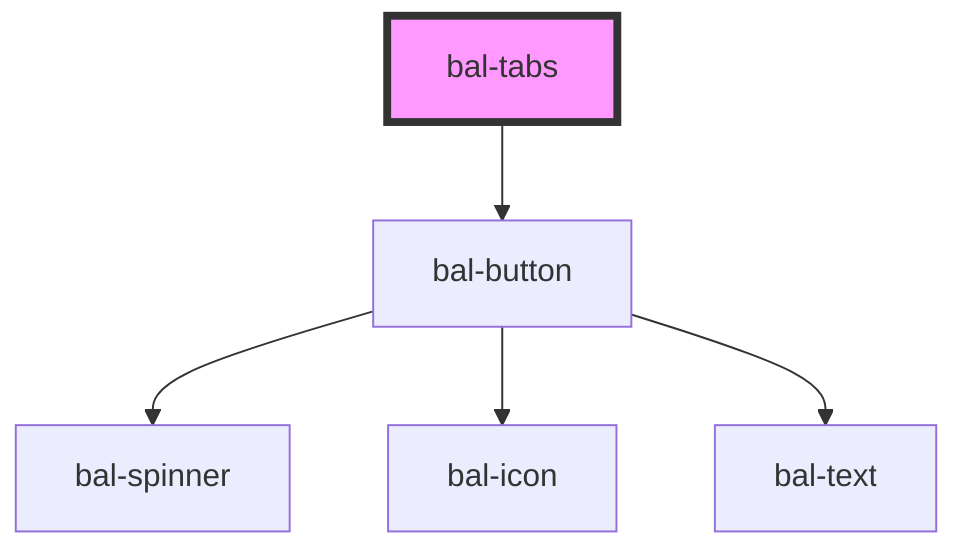

# bal-tabs

Simple responsive horizontal navigation tabs.

<!-- Auto Generated Below -->

## Properties

| Property      | Attribute      | Description                                       | Type      | Default |
| ------------- | -------------- | ------------------------------------------------- | --------- | ------- |
| `action`      | `action`       | If `true` a acation button is added to the right  | `boolean` | `false` |
| `actionLabel` | `action-label` | Label for the action button                       | `string`  | `''`    |
| `dense`       | `dense`        | If `true` the the padding gets reduced.           | `boolean` | `false` |
| `expanded`    | `expanded`     | If `true` the field expands over the whole width. | `boolean` | `false` |
| `rounded`     | `rounded`      | If you want the rounded tab style.                | `boolean` | `false` |

## Events

| Event            | Description                                | Type                        |
| ---------------- | ------------------------------------------ | --------------------------- |
| `balActionClick` | Emitted when the action button has clicked | `CustomEvent<MouseEvent>`   |
| `balChange`      | Emitted when the changes has finished.     | `CustomEvent<BalTabOption>` |

## Methods

### `select(value: string) => Promise<void>`

Dropdown a tab by the value of the tab item.

#### Returns

Type: `Promise<void>`

## Dependencies

### Depends on

- [bal-button](../bal-button)

### Graph

----------------------------------------------

*Built with [StencilJS](https://stenciljs.com/)*
