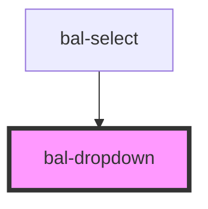

# Dropdown

## Usage

```html
<bal-dropdown id="bal-dropdown-example">
  <bal-dropdown-option value="1" label="Ant-Man"></bal-dropdown-option>
  <bal-dropdown-option value="2" label="Black Panter"></bal-dropdown-option>
  <bal-dropdown-option value="3" label="Black Widow"></bal-dropdown-option>
</bal-dropdown>
```

It can also deal with large content:

```html
<bal-dropdown>
  <bal-dropdown-option value="1" label="Loooooooooooooooooooooooooooooooooooooooooooooooooooooooooooooooooooooooooooooooooooooooooooooooooooooooooooooooooooooooooooooooooooooooooooooooooooooooooooooooooooooooooooooooooooooooongcat"></bal-dropdown-option>
  <bal-dropdown-option value="2" label="Loooooooooooooooooooooooooooooooooooooooooooooooongcat"></bal-dropdown-option>
  <bal-dropdown-option value="3" label="Looooooooooooooooooooooooooooooooooooooooooongcat"></bal-dropdown-option>
  <bal-dropdown-option value="4" label="Loooooooooooooooooooooooooooooooooooooooongcat"></bal-dropdown-option>
  <bal-dropdown-option value="5" label="Looooooooooooooooooooooooooooooooooooongcat"></bal-dropdown-option>
  <bal-dropdown-option value="6" label="Looooooooooooooooooooooooooooooooongcat"></bal-dropdown-option>
  <bal-dropdown-option value="7" label="Longcat"></bal-dropdown-option>
</bal-dropdown>
```

<script type="text/javascript">
    document.getElementById('bal-dropdown-example').value = {
        label: 'Black Panter',
        value: '2'
    }
    document.getElementById('bal-dropdown-example').addEventListener('balBlur', event => { 
        console.log('balBlur on bal-dropdown-example', event) 
    })
    document.getElementById('bal-dropdown-typeahead-example').addEventListener('balInput', event => { 
        console.log('balInput on bal-dropdown-typeahead-example', event) 
    })
    document.getElementById('bal-dropdown-typeahead-example').addEventListener('balChange', event => { 
        console.log('balChange on bal-dropdown-typeahead-example', event) 
    })
    document.getElementById('bal-dropdown-typeahead-example').addEventListener('balBlur', event => { 
        console.log('balBlur on bal-dropdown-typeahead-example', event) 
    })
</script>

### Custom empty message

```html
<bal-dropdown empty>
  <bal-dropdown-option value="1" label="Ant-Man"></bal-dropdown-option>
  <bal-dropdown-option value="2" label="Black Panter"></bal-dropdown-option>
  <bal-dropdown-option value="3" label="Black Widow"></bal-dropdown-option>
  <span slot="is-empty">No Results here! :-(</span>
</bal-dropdown>
```

### Inverted style

```html
<div class="has-background-info is-padded">
  <bal-dropdown inverted>
    <bal-dropdown-option value="1" label="Ant-Man"></bal-dropdown-option>
    <bal-dropdown-option value="2" label="Black Panter"></bal-dropdown-option>
    <bal-dropdown-option value="3" label="Black Widow"></bal-dropdown-option>
  </bal-dropdown>
</div>
```

### Disabled

```html
<bal-dropdown disabled="true">
  <bal-dropdown-option value="1" label="Ant-Man"></bal-dropdown-option>
  <bal-dropdown-option value="2" label="Black Panter"></bal-dropdown-option>
  <bal-dropdown-option value="3" label="Black Widow"></bal-dropdown-option>
</bal-dropdown>
```

### Typeahead

```html
<bal-dropdown expanded typeahead id="bal-dropdown-typeahead-example">
  <bal-dropdown-option value="1" label="Ant-Man"></bal-dropdown-option>
  <bal-dropdown-option value="2" label="Black Panter"></bal-dropdown-option>
  <bal-dropdown-option value="3" label="Black Widow"></bal-dropdown-option>
  <bal-dropdown-option value="4" label="Captain America"></bal-dropdown-option>
  <bal-dropdown-option value="5" label="Captain Marvel"></bal-dropdown-option>
  <bal-dropdown-option value="6" label="Daredevil"></bal-dropdown-option>
  <bal-dropdown-option value="7" label="Dr. Strange"></bal-dropdown-option>
  <bal-dropdown-option value="8" label="Hulk"></bal-dropdown-option>
  <bal-dropdown-option value="9" label="Iron Man"></bal-dropdown-option>
  <bal-dropdown-option value="10" label="Spider Man"></bal-dropdown-option>
  <bal-dropdown-option value="11" label="Thor"></bal-dropdown-option>
  <bal-dropdown-option value="12" label="Wasp"></bal-dropdown-option>
  <bal-dropdown-option value="13" label="Wolverine"></bal-dropdown-option>
</bal-dropdown>
```

### Multi-Select

```html
<bal-dropdown multi-select expanded>
  <bal-dropdown-option checkbox value="1" label="Ant-Man"></bal-dropdown-option>
  <bal-dropdown-option checkbox value="2" label="Black Panter"></bal-dropdown-option>
  <bal-dropdown-option checkbox value="3" label="Black Widow"></bal-dropdown-option>
  <bal-dropdown-option checkbox value="4" label="Captain America"></bal-dropdown-option>
  <bal-dropdown-option checkbox value="5" label="Captain Marvel"></bal-dropdown-option>
  <bal-dropdown-option checkbox value="6" label="Daredevil"></bal-dropdown-option>
  <bal-dropdown-option checkbox value="7" label="Dr. Strange"></bal-dropdown-option>
  <bal-dropdown-option checkbox value="8" label="Hulk"></bal-dropdown-option>
</bal-dropdown>
```

#### With typeahead

```html
<bal-dropdown multi-select typeahead expanded>
  <bal-dropdown-option checkbox value="1" label="Ant-Man"></bal-dropdown-option>
  <bal-dropdown-option checkbox value="2" label="Black Panter"></bal-dropdown-option>
  <bal-dropdown-option checkbox value="3" label="Black Widow"></bal-dropdown-option>
  <bal-dropdown-option checkbox value="4" label="Captain America"></bal-dropdown-option>
  <bal-dropdown-option checkbox value="5" label="Captain Marvel"></bal-dropdown-option>
  <bal-dropdown-option checkbox value="6" label="Daredevil"></bal-dropdown-option>
  <bal-dropdown-option checkbox value="7" label="Dr. Strange"></bal-dropdown-option>
  <bal-dropdown-option checkbox value="8" label="Hulk"></bal-dropdown-option>
  <bal-dropdown-option checkbox value="9" label="Iron Man"></bal-dropdown-option>
  <bal-dropdown-option checkbox value="10" label="Spider Man"></bal-dropdown-option>
  <bal-dropdown-option checkbox value="11" label="Thor"></bal-dropdown-option>
  <bal-dropdown-option checkbox value="12" label="Wasp"></bal-dropdown-option>
  <bal-dropdown-option checkbox value="13" label="Wolverine"></bal-dropdown-option>
  <span slot="no-search-results">No results here with your search term! :-(</span>
</bal-dropdown>
```

<!-- Auto Generated Below -->


## Properties

| Property     | Attribute    | Description | Type      | Default     |
| ------------ | ------------ | ----------- | --------- | ----------- |
| `isActive`   | `is-active`  |             | `boolean` | `false`     |
| `scrollable` | `scrollable` |             | `number`  | `0`         |
| `value`      | `value`      |             | `any`     | `undefined` |


## Events

| Event       | Description | Type                  |
| ----------- | ----------- | --------------------- |
| `balChange` |             | `CustomEvent<string>` |


## Methods

### `close() => Promise<void>`

Closes the dropdown menu.

#### Returns

Type: `Promise<void>`


### `getContentElement() => Promise<HTMLDivElement>`


#### Returns

Type: `Promise<HTMLDivElement>`


### `getMenuElement() => Promise<HTMLDivElement>`


#### Returns

Type: `Promise<HTMLDivElement>`


### `open() => Promise<void>`

Open the dropdown menu.

#### Returns

Type: `Promise<void>`


### `toggle() => Promise<void>`

Open or closes the dropdown.

#### Returns

Type: `Promise<void>`


## Dependencies

### Used by

 - [bal-select](../select)

### Graph


----------------------------------------------

*Built with [StencilJS](https://stenciljs.com/)*
