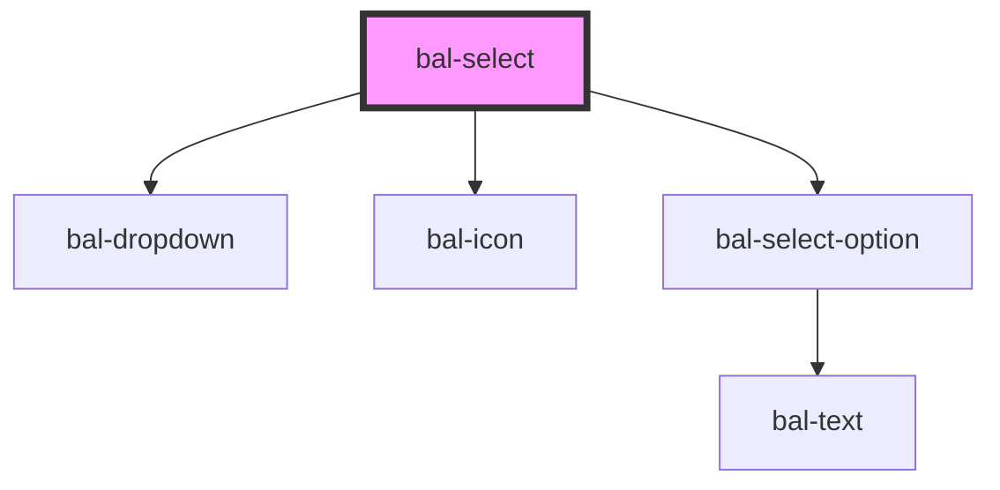

# bal-select

<!-- Auto Generated Below -->

## Properties

| Property      | Attribute     | Description | Type                    | Default     |
| ------------- | ------------- | ----------- | ----------------------- | ----------- |
| `disabled`    | `disabled`    |             | `boolean`               | `false`     |
| `loading`     | `loading`     |             | `boolean`               | `false`     |
| `options`     | --            |             | `BalOptionValue<any>[]` | `[]`        |
| `placeholder` | `placeholder` |             | `string`                | `''`        |
| `remote`      | `remote`      |             | `boolean`               | `false`     |
| `typeahead`   | `typeahead`   |             | `boolean`               | `false`     |
| `value`       | --            |             | `BalOptionValue<any>`   | `undefined` |

## Events

| Event       | Description                                                | Type                  |
| ----------- | ---------------------------------------------------------- | --------------------- |
| `balBlur`   | Emitted when the toggle loses focus.                       | `CustomEvent<void>`   |
| `balChange` |                                                            | `CustomEvent<any>`    |
| `balFocus`  | Emitted when the toggle has focus..                        | `CustomEvent<void>`   |
| `balInput`  | Emitted when containing input field raises an input event. | `CustomEvent<string>` |

## Dependencies

### Depends on

- [bal-dropdown](../dropdown)
- [bal-icon](../icon)
- [bal-select-option](../select-option)

### Graph

----------------------------------------------

*Built with [StencilJS](https://stenciljs.com/)*
